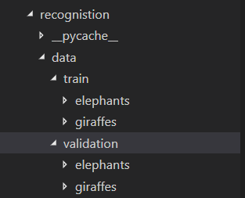
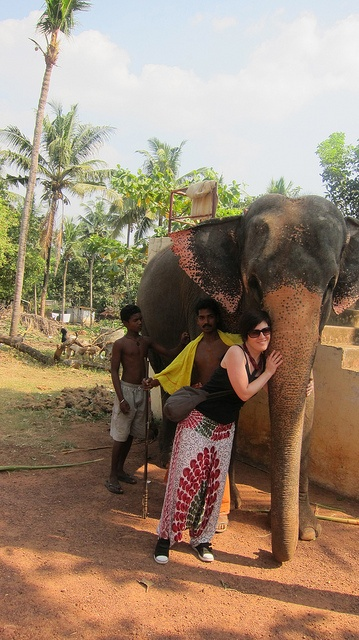
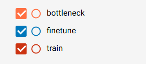

# EC601 Mini Project 2: 

In this assignment, I used data from MS COCO dataset to train image classification and object detection neural networks.

## Content

* processing MS COCO dataset into compact format for training
* train image classification neural network on two classes from MS COCO dataset(elephant vs. giraffe):
  
  1. home-made convolutional model auchitecture
  2. fully-connected classifier with bottleneck neature from VGG-16 image recognition model
  3. fine-tuning from VGG-16 image recognition model
* train object recognition neural network on one class from MS COCO dataset(tennis racket)
  
  1. fine-tuning the last two layer of a pre-trained Tiny-YOLO model

## Get Started

* Hardware and System Setup

    All the code in this repository is developed on Windows 10 with CUDA 9.0. Code is supposed to be able to run on any platform. If your machine has a CUDA compatible GPU, you can get CUDA from the NVidia official site.  
* Software Dependencies

    1. tensorflow-gpu(1.11.0)
    2. Keras(2.1.5)
    3. OpenCV(3.4.3)
    4. cocoapi(Python)  # used for processing MS COCO dataset
* Dataset
  
    MS COCO
    

## How it Works?

### Image Classification Model

In this section, I will introduce how to train a image recognition model using code in this repo. After following the great tutorial from Keras, here I will introduce three ways to train a image classification model using data from MS COCO dataset. 

#### Data Preparation

First thing you have to do is to prepare data(images). Since we are trying to train classification model, the work of data preparation is relatively easy. What we have to do only is putting images into correct directory(using the name of the folder as label). 

Using the **coco_proc.py** to prepare data:

Open the coco_proc.py file, scroll down to the bottom, then you can find the main function. 


``` Python
if __name__ == "__main__":

    sets = {'train': 'train2017',
                'val': 'val2017'}   # Modify the dataset name here corresponding to what you actually download

    coco_path = 'D:\\downloads\\datasets\\'  # Modify the path here correponding to the directory you store you dataset folders

    w = coco_worker(dataDir = coco_path,
                    dataType = sets['train'])

    classes = ['tennis racket']  # The class you want to refer, for now it only support single class
    # TODO: support refering to multiple classes 

    #w.loop_classes(classes)   # Looping throught the dataset, checking images from specific class with bounding boxes
    #w.gen_train_txt(classes)  # Prepare training data for YOLO models
    w.save_recognition(["elephant"], "recognistion/data/train/", 1000)  # Prepare training data for image classification models
```

You have to specify the name of you dataset(typically the name of the folder contains image when you uncompressed the coco dataset, for example when you download the 2017 version coco training set, the folder name is "train2017"), here I have the 2017 version training set and validation set. You also have to specify where you store all the images. 

In the last function **save_recognition()**, you need to specify the class you want to extract from coco and where you want to store them. Here I extract the class **elephant** from coco for training classification model. The other class I extracted is **giraffe**, so I run the code twice(actually 4 times, I also need to run other 2 times for extracting validation data). 

```
  python coco_proc.py
```

Then I can find the training and validating images in the subfolders(elephants & giraffes).

  

Sample image:

  

#### Training classification network with three models

This section introduce how to train image classification model in three different ways: 

  1. train from scratch(with a ad-hoc model architecture) # train
  2. using the bottleneck feature to train classifier # bottleneck
  3. apply transfer learning on a existed model # finetune

##### Train from scratch

  ```
    python train.py
  ```

##### Using bottleneck feature

  ```
    python train_bottleneck.py
  ```

##### Fine-tune VGG-16 model

  ```
    python fine_tune.py
  ```

#### Ploting the training and validating curves(TensorBoard)

```
  cd recognistion/logs
  tensorboard --logdir .
```

* legends

  

* accuracy on training data

  

* loss on training data

  

* accuracy on validation data
  
  

* loss on validation data
  
  


### Object Recognition Model