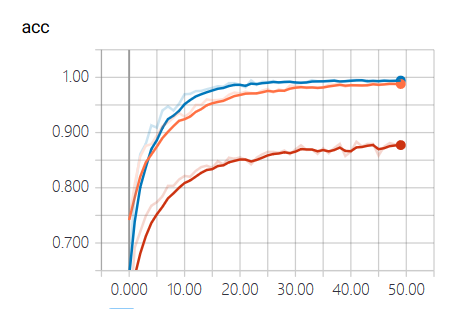

# EC601 Mini Project 2: 

In this assignment, I used data from MS COCO dataset to train image classification and object detection neural networks.

## Content

* processing MS COCO dataset into compact format for training
* train image classification neural network on two classes from MS COCO dataset(elephant vs. giraffe):
  
  1. home-made convolutional model auchitecture
  2. fully-connected classifier with bottleneck neature from VGG-16 image recognition model
  3. fine-tuning from VGG-16 image recognition model
* train object recognition neural network on one class from MS COCO dataset(tennis racket)
  
  1. fine-tuning the last two layer of a pre-trained Tiny-YOLO model

## Get Started

* Hardware and System Setup

    All the code in this repository is developed on Windows 10 with CUDA 9.0. Code is supposed to be able to run on any platform. If your machine has a CUDA compatible GPU, you can get CUDA from the NVidia official site.  
* Software Dependencies

    1. tensorflow-gpu(1.11.0)
    2. Keras(2.1.5)
    3. OpenCV(3.4.3)

## How it Works?

### Image Classification Model

s

### Object Recognition Model