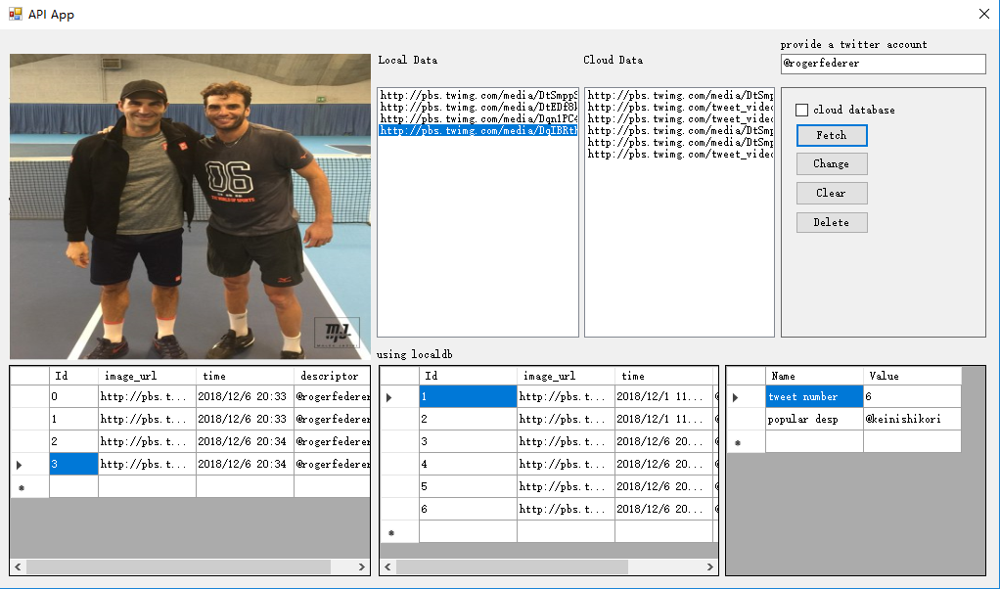

## Mini-project 3 Database

* This project is about using databases and cloud APIs to build a desktop application to provide user with the function of viewing and analysis images on twitter.

### Database Configuration

* In this application, I use 2 databases to accomplish the desire function: a sql database(LocalDB from Visual Studio) to store temporal data; and a non-sql database(MongoDB Atlas) to store data in the cloud.

### API APP (the desktop application wrapper of database and cloud API)

* I built a simple desktop application using Windows Form technology with C# language. 
* This application can be used to fetch images from twitter posts and store information in local/cloud databases.
* 2 databases are used for different part of the application: a SQL database(LocalDB which comes with Microsoft Visual Studio) for storing data locally; a Non-SQL database(MongoDB Atlas from Mongo) for storing data in the cloud.
  

* The user interface of the application has several parts:

    1. A image display window;
    2. 2 ListBox for displaying fetched twitter post(of different databases);
    3. 2 GridViews for displaying detailed information of each post
    4. A statistic window displays interesting stats;
    5. Twitter account input textbox;
    6. Control panel;