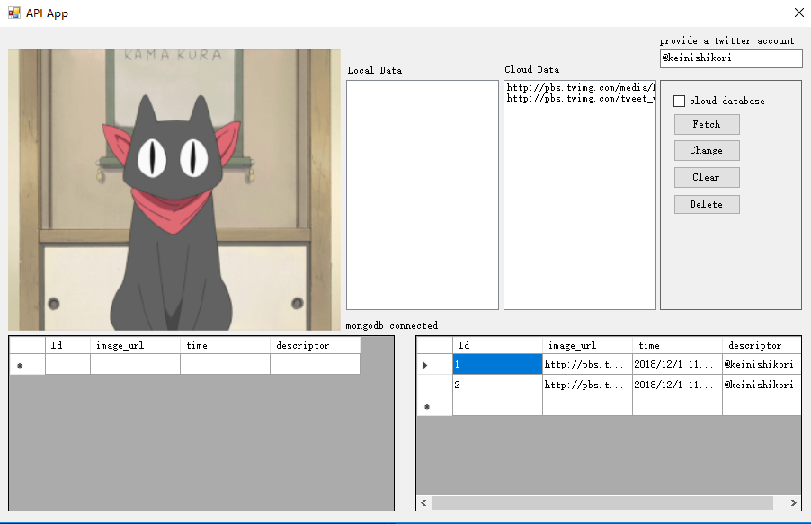

## Mini-project 3 Database

* This project is about using databases and cloud APIs to build a desktop application to provide user with the function of viewing and analysis images on twitter.

### Database Configuration

* In this application, I use 2 databases to accomplish the desire function: a sql database(LocalDB from Visual Studio) to store temporal data; and a non-sql database(MongoDB Atlas) to store data in the cloud.

